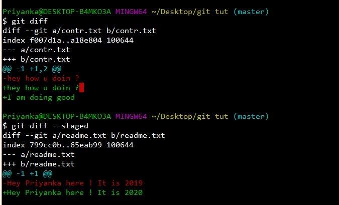

# git-handbook
Just so that I don't forget the git commands ! 

## What is Version Control ?

A version control system is just a software that helps you manage different versions of your project.
When you use version control, you create safe points that save your project, giving you total freedom and security to change anything about your project, and not worry about losing any of your data.

The main point of a VCS is to help us maintain a detailed history of the project, and to work onn different versions of it too.

A Source Code Manager(SCM) is another name for a version control system.

## Types of Version Control System Models

1. Centralised : A central computer hosts all the projects, and all the interactions should happen through it.
2. Distributed : There's no such central repository, each developer has a complete copy of the project on their system.

## Most Popular Version Control Systems 

1. git
2. Subversion
3. Mercurial

## Git vs Github :

Git is a distributed version control system. Git and Github are different from each other. Git is a version control tool while Github is a service that hosts git projects.

## git- Key Terms

### 1. Version control system (VCS)- 

A VCS allows you to revert a file/project to a previous state, to see who made the changes and when or who introduced an issue etc.

## 1. Git init
The command is used to initialise a local repo as git repo.
``` git init```

## 2. Git clone

To clone a repo :

``` git clone <URL>```

To clone a repo in a directory with a different name

``` git clone <URL> dir-name ```

At this point of time, you must be having a Git repo on your local machine, and a checkout/ working-copy of all the files.<br>
So now, you make changes.<br>
And at any point you wish to record the state of the project, you <b>commit the snapshot of those changes</b><br>
<br>

### States of a File :

1. <b>Tracked</b> - the files that  Git knows about, can be modified, unmodified or staged.
2. <b>Untracked</b> - any file that wasn't present in your last snapshot.

Note : Initially, all files are tracked and unmodified.Once you make changes to any file, Git marks them as modified (since it has changed in comparison to the last commit), and then as you work, you selectively stage the modified files and commit the staged changes. And the cycle repeats !<br>

Untracked  -> Staged (Add the file)<br>
Unmodified -> Modified (Edit the file)<br>
Modified -> Staged (Stage the file )<br>
Staged -> Unmodified (Committed the file)<br>
Unmodified -> Untracked (removed the file)<br>

## 3. Git Status

used  to determine which files are in which state.

``` git status 
On branch master
Your branch is up-to-date with 'origin/master'.
nothing to commit, working directory clean
```

Means -
1. Tells that you are on the branch master.
2. Informs that the the branch has not diverged from the same branch on the server.
3. Clean working directory - meaning by that none of the tracked files have been modified.
4. If it shows "Changes to be committed:" then it means that the following files have been staged.
5. If it shows "Changes not staged for commit :" means that a file that is tracked has been modified in the working directory but not yet staged. To stage it, you run the ```git add``` command.
5. If it shows "Untracked files", then you can track/stage it using ```git add```.

## 4. Git add

used to track new files.

``` git add  <file-name>```

Once you run ```git add``` on a file, it gets tracked and staged.

Basically, ``` git add``` is a multipurpose command, you use it to begin tracking new files, to stage files, and to do other things like marking merge-conflicted files as resolved. It may be helpful to think of it more as “add precisely this content to the next commit” rather than “add this file to the project”.

Note : Git stages a file exactly as it is when you run the git add command. So, If you modify a file after you run git add, you have to run git add again to stage the latest version of the file.

Suppose, you modified a file after running git add, and do ```git status```, the file name will be shown both under the staged section, as well as the unstaged section. And in case you do, ```git commit``` from here , the state of the file on that previous git add gets committed , and not the current state.

So, to get the current state of the file to get committed, you must run  ``` git add ``` again.

## 5. Git ignore 

For files such as log files, or build system files that you don't want Git to add or show them as untracked, you can ask Git to ignore them using the ```.gitignore``` file. 

``` 
cat .gitignore
*.[oa]
*~
node_modules/
```

Here, the first line archives all the files ending with ```.o``` or ```.a```.<br>
The second line archives all the files ending with ```.~```.<br>
The third line archives the entire directory called node_modules.<br>

Note : Always set up a ```.gitignore``` file for a new project, before you get going so that you don't accidently commit any such files.

## 6. Git diff

The command is used to know what exactly were the changes, and not just the files where you made the changes.
``` git diff``` shows you the exact lines added and removed- the patch, as they were. The command basically answers two questions - What changes are yet to be staged ( use ``` git diff ```) ? and What staged changes are yet to get committed ?( use ```git diff --staged```) <br>


Suppose you have two files, ```readme.txt``` and ```contr.txt```, and you've staged readme but not contr, you get the following response - 


